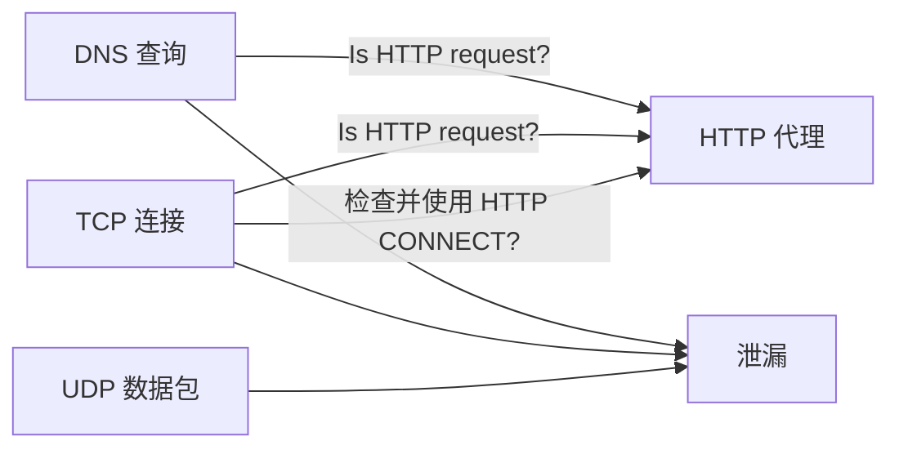
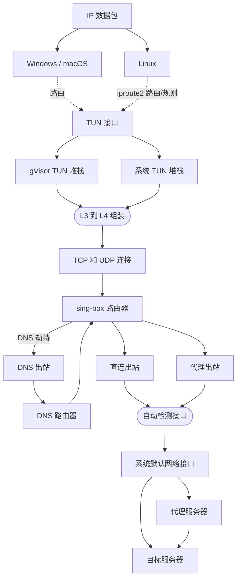

# 客户端

### :material-ray-start: 简介

长期以来，图形操作系统的现代代理客户端使用方式和原理一直没有得到清晰的描述。
不过，我们可以将它们分为三种类型：系统代理、防火墙重定向和虚拟接口。

### :material-web-refresh: 系统代理

几乎所有图形环境都支持系统级代理，它们本质上是只支持 TCP 的普通 HTTP 代理。

| 操作系统 / 桌面环境                   | 系统代理                         | 应用支持 |
|:---------------------------------------------|:-------------------------------------|:--------------------|
| Windows                                      | :material-check:                     | :material-check:    |
| macOS                                        | :material-check:                     | :material-check:    |
| GNOME/KDE                                    | :material-check:                     | :material-check:    |
| Android                                      | 需要 ROOT 或 adb（权限） | :material-check:    |
| Android/iOS（使用 sing-box 图形客户端） | 通过 `tun.platform.http_proxy`        | :material-check:    |

作为最著名的代理方式之一，它有许多缺点：
许多不是基于 HTTP 的 TCP 客户端不会检查和使用系统代理。
此外，UDP 和 ICMP 流量会绕过代理。



### :material-wall-fire: 防火墙重定向

这类用法通常依赖于操作系统提供的防火墙或钩子接口，
如 Windows 的 WFP、Linux 的 redirect、TProxy 和 eBPF，以及 macOS 的 pf。
虽然这种方式侵入性强且配置繁琐，
但由于对软件技术要求较低，它在 V2Ray 等业余代理开源项目社区中仍然很受欢迎。

### :material-expansion-card: 虚拟接口

所有 L2/L3 代理（严格定义的 VPN，如 OpenVPN、WireGuard）都基于虚拟网络接口，
这也是所有 L4 代理在 Android、iOS 等移动平台上作为 VPN 工作的唯一方式。

sing-box 继承并发展了 clash-premium 的 TUN 入站（L3 到 L4 转换），
作为执行透明代理的最合理方法。



## :material-cellphone-link: 示例

### 面向中国用户的基本 TUN 用法

=== ":material-numeric-4-box: 仅 IPv4"

    ```json
    {
      "dns": {
        "servers": [
          {
            "tag": "google",
            "type": "tls",
            "server": "8.8.8.8"
          },
          {
            "tag": "local",
            "type": "udp",
            "server": "223.5.5.5"
          }
        ],
        "strategy": "ipv4_only"
      },
      "inbounds": [
        {
          "type": "tun",
          "address": ["172.19.0.1/30"],
          "auto_route": true,
          // "auto_redirect": true, // 在 Linux 上
          "strict_route": true
        }
      ],
      "outbounds": [
        // ...
        {
          "type": "direct",
          "tag": "direct"
        }
      ],
      "route": {
        "rules": [
          {
            "action": "sniff"
          },
          {
            "protocol": "dns",
            "action": "hijack-dns"
          },
          {
            "ip_is_private": true,
            "outbound": "direct"
          }
        ],
        "default_domain_resolver": "local",
        "auto_detect_interface": true
      }
    }
    ```

=== ":material-numeric-6-box: IPv4 和 IPv6"

    ```json
    {
      "dns": {
        "servers": [
          {
            "tag": "google",
            "type": "tls",
            "server": "8.8.8.8"
          },
          {
            "tag": "local",
            "type": "udp",
            "server": "223.5.5.5"
          }
        ]
      },
      "inbounds": [
        {
          "type": "tun",
          "address": ["172.19.0.1/30", "fdfe:dcba:9876::1/126"],
          "auto_route": true,
          // "auto_redirect": true, // 在 Linux 上
          "strict_route": true
        }
      ],
      "outbounds": [
        // ...
        {
          "type": "direct",
          "tag": "direct"
        }
      ],
      "route": {
        "rules": [
          {
            "action": "sniff"
          },
          {
            "protocol": "dns",
            "action": "hijack-dns"
          },
          {
            "ip_is_private": true,
            "outbound": "direct"
          }
        ],
        "default_domain_resolver": "local",
        "auto_detect_interface": true
      }
    }
    ```

=== ":material-domain-switch: FakeIP"

    ```json
    {
      "dns": {
        "servers": [
          {
            "tag": "google",
            "type": "tls",
            "server": "8.8.8.8"
          },
          {
            "tag": "local",
            "type": "udp",
            "server": "223.5.5.5"
          },
          {
            "tag": "remote",
            "type": "fakeip",
            "inet4_range": "198.18.0.0/15",
            "inet6_range": "fc00::/18"
          }
        ],
        "rules": [
          {
            "query_type": [
              "A",
              "AAAA"
            ],
            "server": "remote"
          }
        ],
        "independent_cache": true
      },
      "inbounds": [
        {
          "type": "tun",
          "address": ["172.19.0.1/30","fdfe:dcba:9876::1/126"],
          "auto_route": true,
          // "auto_redirect": true, // 在 Linux 上
          "strict_route": true
        }
      ],
      "outbounds": [
        // ...
        {
          "type": "direct",
          "tag": "direct"
        }
      ],
      "route": {
        "rules": [
          {
            "action": "sniff"
          },
          {
            "protocol": "dns",
            "action": "hijack-dns"
          },
          {
            "ip_is_private": true,
            "outbound": "direct"
          }
        ],
        "default_domain_resolver": "local",
        "auto_detect_interface": true
      }
    }
    ```

### 面向中国用户的流量绕过用法

=== ":material-dns: DNS 规则"

    === ":material-shield-off: 存在 DNS 泄漏"

        ```json
        {
          "dns": {
            "servers": [
              {
                "tag": "google",
                "type": "tls",
                "server": "8.8.8.8"
              },
              {
                "tag": "local",
                "type": "https",
                "server": "223.5.5.5"
              }
            ],
            "rules": [
              {
                "rule_set": "geosite-geolocation-cn",
                "server": "local"
              },
              {
                "type": "logical",
                "mode": "and",
                "rules": [
                  {
                    "rule_set": "geosite-geolocation-!cn",
                    "invert": true
                  },
                  {
                    "rule_set": "geoip-cn"
                  }
                ],
                "server": "local"
              }
            ]
          },
          "route": {
            "default_domain_resolver": "local",
            "rule_set": [
              {
                "type": "remote",
                "tag": "geosite-geolocation-cn",
                "format": "binary",
                "url": "https://raw.githubusercontent.com/SagerNet/sing-geosite/rule-set/geosite-geolocation-cn.srs"
              },
              {
                "type": "remote",
                "tag": "geosite-geolocation-!cn",
                "format": "binary",
                "url": "https://raw.githubusercontent.com/SagerNet/sing-geosite/rule-set/geosite-geolocation-!cn.srs"
              },
              {
                "type": "remote",
                "tag": "geoip-cn",
                "format": "binary",
                "url": "https://raw.githubusercontent.com/SagerNet/sing-geoip/rule-set/geoip-cn.srs"
              }
            ]
          },
          "experimental": {
            "cache_file": {
              "enabled": true,
              "store_rdrc": true
            },
            "clash_api": {
              "default_mode": "Enhanced"
            }
          }
        }
        ```

    === ":material-security: 无 DNS 泄漏，但较慢"

        ```json
        {
          "dns": {
            "servers": [
              {
                "tag": "google",
                "type": "tls",
                "server": "8.8.8.8"
              },
              {
                "tag": "local",
                "type": "https",
                "server": "223.5.5.5"
              }
            ],
            "rules": [
              {
                "rule_set": "geosite-geolocation-cn",
                "server": "local"
              },
              {
                "type": "logical",
                "mode": "and",
                "rules": [
                  {
                    "rule_set": "geosite-geolocation-!cn",
                    "invert": true
                  },
                  {
                    "rule_set": "geoip-cn"
                  }
                ],
                "server": "google",
                "client_subnet": "114.114.114.114/24" // 任意中国客户端 IP 地址
              }
            ]
          },
          "route": {
            "default_domain_resolver": "local",
            "rule_set": [
              {
                "type": "remote",
                "tag": "geosite-geolocation-cn",
                "format": "binary",
                "url": "https://raw.githubusercontent.com/SagerNet/sing-geosite/rule-set/geosite-geolocation-cn.srs"
              },
              {
                "type": "remote",
                "tag": "geosite-geolocation-!cn",
                "format": "binary",
                "url": "https://raw.githubusercontent.com/SagerNet/sing-geosite/rule-set/geosite-geolocation-!cn.srs"
              },
              {
                "type": "remote",
                "tag": "geoip-cn",
                "format": "binary",
                "url": "https://raw.githubusercontent.com/SagerNet/sing-geoip/rule-set/geoip-cn.srs"
              }
            ]
          },
          "experimental": {
            "cache_file": {
              "enabled": true,
              "store_rdrc": true
            },
            "clash_api": {
              "default_mode": "Enhanced"
            }
          }
        }
        ```

=== ":material-router-network: 路由规则"

    ```json
    {
      "outbounds": [
        {
          "type": "direct",
          "tag": "direct"
        }
      ],
      "route": {
        "rules": [
          {
            "action": "sniff"
          },
          {
            "type": "logical",
            "mode": "or",
            "rules": [
              {
                "protocol": "dns"
              },
              {
                "port": 53
              }
            ],
            "action": "hijack-dns"
          },
          {
            "ip_is_private": true,
            "outbound": "direct"
          },
          {
            "type": "logical",
            "mode": "or",
            "rules": [
              {
                "port": 853
              },
              {
                "network": "udp",
                "port": 443
              },
              {
                "protocol": "stun"
              }
            ],
            "action": "reject"
          },
          {
            "rule_set": "geosite-geolocation-cn",
            "outbound": "direct"
          },
          {
            "type": "logical",
            "mode": "and",
            "rules": [
              {
                "rule_set": "geoip-cn"
              },
              {
                "rule_set": "geosite-geolocation-!cn",
                "invert": true
              }
            ],
            "outbound": "direct"
          }
        ],
        "rule_set": [
          {
            "type": "remote",
            "tag": "geoip-cn",
            "format": "binary",
            "url": "https://raw.githubusercontent.com/SagerNet/sing-geoip/rule-set/geoip-cn.srs"
          },
          {
            "type": "remote",
            "tag": "geosite-geolocation-cn",
            "format": "binary",
            "url": "https://raw.githubusercontent.com/SagerNet/sing-geosite/rule-set/geosite-geolocation-cn.srs"
          }
        ]
      }
    }
    ```